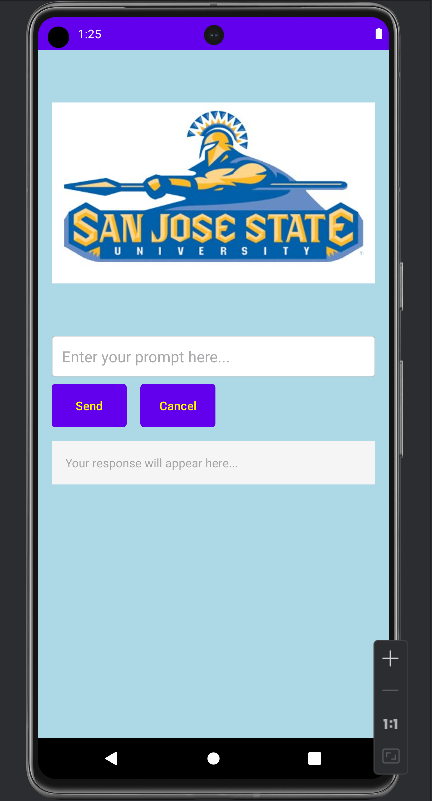

# CMPE277-Android-ChatGPT-UI-App
The purpose of the app is to apply AsyncTask to call Open AI LLM (ChatGPT 3.5 Turbo) model in the background and display response to the Android App. 

*	University Name: http://www.sjsu.edu/
*	Course: CMPE 277 - Smartphone App Dev
*	Professor: [ChandraSekar Vuppalapati](https://www.linkedin.com/in/chandrasekarvuppalapati/)

### Screenshots

Home Screen: ChatGPT App

Entering message in EditText :

On clicking “Send” button, message is sent through ChatGPT API:

On clicking “Cancel” button, message and response is cleared:

